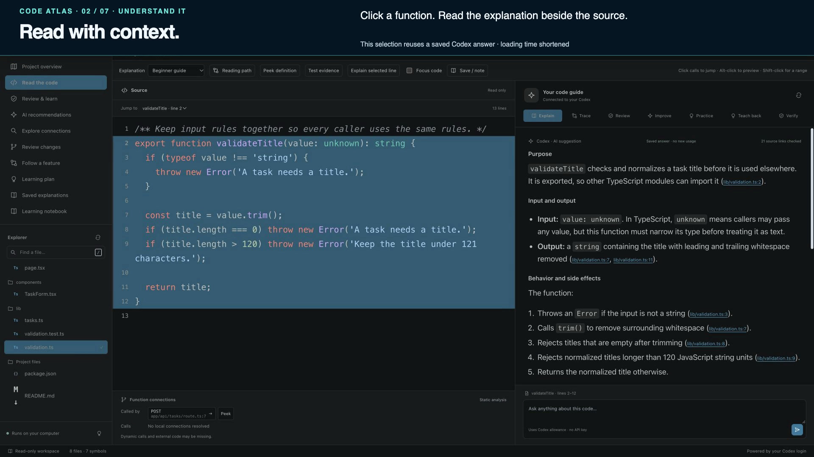

# Code Atlas

Code Atlas is a free, local app for reading and understanding source code. Open a project, follow functions and imports, inspect suggested reading paths, and use your signed-in Codex CLI for explanations, reviews, and practice. The included [Tiny Tasks example](examples/tiny-tasks/README.md) lets you try it without opening one of your own repositories.

## Get started

Install [Node.js 22 or newer](https://nodejs.org/) and, for AI features, the [Codex CLI](https://developers.openai.com/codex/cli). From this repository:

```sh
git clone https://github.com/seekerPrice/code-atlas.git
cd code-atlas
npm ci
npm run build
npm start
```

Open [http://127.0.0.1:4317](http://127.0.0.1:4317). On macOS, `Start Code Atlas.command` can start the app from a downloaded source checkout. Set `PORT=4318` to choose another port. Set `CODE_ATLAS_CODEX` to the Codex executable path if it is not on `PATH`.

Click **Explore an example** to read Tiny Tasks. For your own project, click **Open a project** and select its source folder. Code Atlas indexes supported text files; it does not install dependencies or run the opened project. Use the file explorer, entry candidates, function links, reading path, feature search, and workspace map to explore without AI access. Click a function or select lines to ask Codex for an explanation. The Review, Improve, Verify, Practice, and Teach back modes guide deeper work.

On macOS, **Choose in Finder** opens the system folder picker and loads the project you select. Cancelling keeps your current project open. You can also browse the folder list or enter a path; these options remain available on other platforms and if the native picker cannot open.

[](docs/demo/code-atlas-demo.mp4)

[Watch the updated demo](docs/demo/code-atlas-demo.mp4) · [Demo notes](docs/demo/README.md)

## Codex and privacy

AI features use your Codex CLI ChatGPT sign-in and its existing allowance. New AI requests use medium reasoning effort. They need a compatible signed-in CLI and network access; plan limits and account billing still apply. Code Atlas does not use an API-key fallback, and you do not need a separate app subscription. Static source browsing works without Codex.

Indexing and source navigation run locally. When you ask Codex, selected source context is sent to OpenAI through the CLI, subject to your account's data policies. Context can include a bounded file list, symbol details, the selected file, and nearby related source. Do not open sensitive code unless you are permitted to send that context. The app does not read your stored Codex credentials.

The server listens on `127.0.0.1` and checks request origin and a session token. It is designed for one user on one computer. Do not put it behind a public proxy or tunnel. Its file filter skips hidden files, ignored paths, symlinks, common credential filenames, and large or unsupported files, but it is not a secret scanner. Nested `.gitignore` and `.atlasignore` rules are applied. The index caps at 20,000 files, 150 MB, and directory depth 24, with omissions shown in the UI.

Codex runs in a temporary directory with read-only sandboxing. The app does not ask it to edit the opened project. AI answers and source citations can be wrong: source links are checked for valid supplied locations, not for the truth of a claim. Every generated claim starts as **AI suggestion**. A checked citation alone never promotes it. Use **Record my check** to attach steps, expected behavior, observed results, and an explicit personal attestation. **Source-supported · user checked** records a source inspection; **Independently verified · user reported** additionally requires a separate test or reproduction reference. These labels describe your recorded evidence, not an automatic certification by Code Atlas. Contradictory/inconclusive observations remove the stronger label, and stale supporting context cannot receive it. Review suggestions and test discovery are prompts for human verification; project tests are displayed, not run.

## Data stored on your computer

- Saved explanations are stored under `~/.code-atlas/answers` by default. Set `CODE_ATLAS_CACHE_DIR` to use another location. You can inspect or clear a project's answers in **Saved explanations**. New source answers track the files and structural context that support them. An unrelated README or source edit can preserve reuse across refresh and restart. Changes to supporting files, relevant call/import/test relationships, comparisons, or Git diffs require a new answer. Overview and feature-wide questions still use project-wide freshness; configuration dependencies remain conservative. Older answers without dependency metadata use the original revision check, and historical or unknown freshness is labeled.
- Notes, practice attempts, recorded evidence checks, theme choice, and recent project selection are stored in your browser's local storage. You can remove attempts and notes in the app or clear site data in the browser. Notes can be exported as Markdown.
- No cloud database or telemetry service is part of Code Atlas. Codex itself connects to OpenAI for AI requests.

## Practice with known answers

The learning plan offers 14 authored JavaScript examples across seven concepts: mutation/shallow copies, runtime validation, async errors, reference equality, nullish defaults, array transformations, and closures. Predictions are graded locally against known answers, without a Codex request or executing the example code. Answers stay hidden until submission. A correct prediction is one checked example, not a mastery score.

When a prior lesson matches a supported concept and language, **Practice the same concept** selects another variant of that concept. Unknown, ambiguous, or other-language topics are not silently mapped to JavaScript; revisit the original source or explicitly choose a curated topic. AI teach-back remains available for your own source and is labeled separately from curated checks.

## Scope and limits

AI prompts adapt explanations and review checks to the language, dialect, and framework evidenced by the supplied source, including mixed-language and declarative files. Unfamiliar syntax and missing context are disclosed rather than guessed. This does not guarantee every language is understood or add semantic navigation for every language; only indexed, supported text files can be supplied through the app.

Code Atlas resolves common JavaScript and TypeScript imports, re-exports, functions, methods, and calls, including local TypeScript aliases and workspace package entry exports. Dynamic calls, framework behavior, network effects, and runtime branches may be unresolved. Python definitions and other supported text files are readable, with less structural analysis. Suggested entry points and feature paths are static clues, not observed execution traces.

Git review requires a repository with a HEAD commit and its root folder open. It supports working tree, staged, and unstaged diffs; renames appear as deletion and addition. The app does not perform a complete security audit, fix findings, or run discovered tests. A saved answer can become stale after a source edit; refresh or ask again.

The **Follow VS Code** theme reads locally installed VS Code appearance settings where supported and falls back to a built-in theme. Theme import currently supports the standard macOS VS Code location. Other platforms can use the built-in themes. The full test suite runs in CI on macOS and Linux; Windows has install, build, and static release checks but has not been fully validated for runtime behavior. Browser combinations beyond those checked locally have not been verified.

## Develop and release

```sh
npm ci
npm run check
npm test
npm run build
npm run release:check
```

`npm run release:check` checks syntax, tests, the build, and the public archive's file list for excluded private or machine-specific material. `npm run release:pack` writes two checked archives under `dist/`: a GitHub-ready source folder and `.tar.gz` with the lockfile and CI workflow, plus an npm `.tgz` with built browser code. Both exclude local research, screenshots, private acceptance material, caches, and dependencies. Use `npm ci` in the source export. npm's archive format intentionally omits `package-lock.json`, so use `npm install` when running directly from the npm archive.

See [CONTRIBUTING.md](CONTRIBUTING.md), [SECURITY.md](SECURITY.md), [LICENSE](LICENSE), and [third-party notices](THIRD_PARTY_NOTICES.md). Code Atlas is licensed under MIT. Dependencies and the demo soundtrack retain their own licenses.
